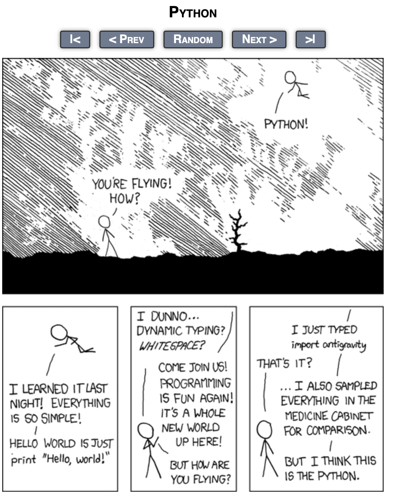

# GitHub Peru Analytics

A data analytics platform that extracts, processes, and visualizes information about the Peruvian developer ecosystem using the GitHub API.

## Screenshot: Antigravity Easter Egg

## Key Findings
1. 76% of Peruvian repositories are classified under Information and Communication
2. The most influential developer (devaige) has an impact score of ~9000
3. Only 2% of developers are currently active (pushed in last 90 days)
4. Top languages used by Peruvian developers are JavaScript, Python, and HTML
5. 200 developers and 1000 repositories analyzed across Lima, Cusco, Arequipa, Trujillo and Cajamarca

## Data Collection
- 200 unique users collected from 5 Peruvian cities
- 1000 repositories extracted and analyzed
- Rate limiting handled with exponential backoff

## Features
- Overview dashboard with key ecosystem statistics
- Developer explorer with filters
- Repository browser with industry classification
- Industry analysis visualizations
- Language analytics with heatmap

## Installation
1. Clone the repository
2. Create a virtual environment: `python -m venv .venv && source .venv/bin/activate`
3. Install dependencies: `pip install -r requirements.txt`
4. Create `.env` file with your API keys (see `.env.example`)

## DEMO Video
## Video Demo
[Ver video en YouTube](https://youtu.be/jwynzvM-WZs)